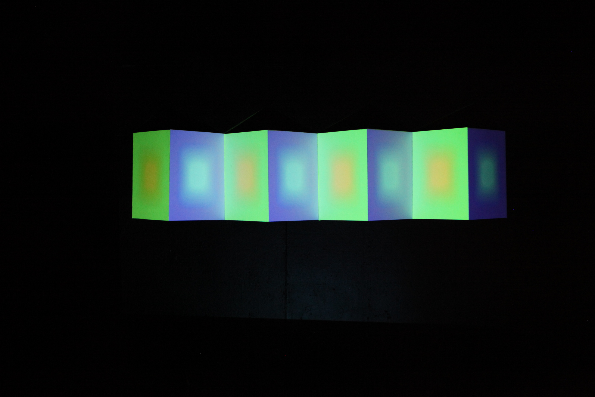
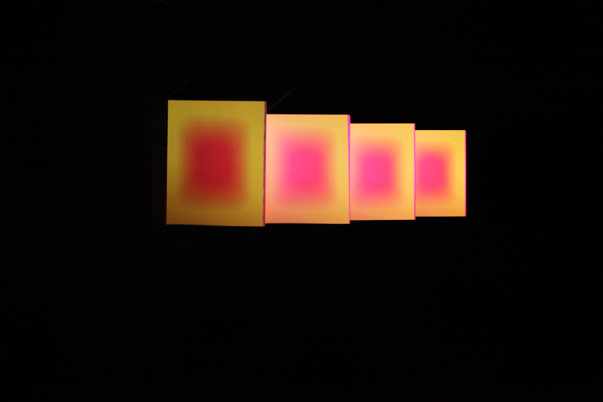

# SteamRave-Cells-Exhibit

Projection art with the v1 Kinect Sensor (Xbox 1414)

## Overview

This repository contains the code for the Cells exhibit for 2022 SteamRave at Brown University and Rhode Island School of Design.

We project solid colored rectangles onto a series of panels. The hue of each rectangle cycles as a funciton of time. A Kinect Sensor was used to measure the distance of the viewer from the exhibit.

- `main` changes the blur of the inner cell as a function of the distance. The closer the viewer is, the more in focus it will become. This was the implementation that was used for the exhibit.
- In `implementations/sizingCell`, we varied the size of the inner cell based on the distance in `sizingCell`.
- In `implementations/mappingSilhouette`, we projected each individuals silhouette onto each panel in addition to changing the size of the inner cell based on the distance.
- `functions/` contains smaller, specific functions for testing and debugging.
- `result/` contains images of the final result of the exhibit.
- `references/` contains references image that were used in the brainstorming and design of the project.

## Exhibit

The actual exhibit will project this image onto panels arranged in a jutting arrangement so that only one side of the panels will be viewable from the side.

## How to Run

Note: This project uses the **Kinect4WinSDK** library. This means that you will not be able to use the Kinect sensor using this code on Mac. You may still use everything else, but you will need to comment out the commands that use the **Kinect4WinSDK** library.

- Ensure you have the necessary drivers and libraries. You will need to install the Kinect Software and Processing libraries (below).
- To run the program, you can just clone (or download the file) anywhere on your computer and double-click to open it.
- Run the sketch in Processing.
- To adjust each panel, press 'c' to enter/exit edit mode. Press 's' to save and 'l' to load layouts.

## Installing Kinect Software (Windows)

To use the Kinect sensor, install the following from Microsoft.

- [Kinect for Windows Developer Toolkit v1.8](https://www.microsoft.com/en-us/download/confirmation.aspx?id=40276)
- [Kinect for Windows SDK 1.8](https://www.microsoft.com/en-us/download/confirmation.aspx?id=40278)

## Using Processing

[Install Processing 3.5.4](https://processing.org/download)

Unzip the download into a folder you want to work in. In the folder, open the processing application.

## Installing Necessary Libraries in Processing

Open the processing application and go to the top where it says "Sketch". Next, go to "Import Library" -> "Add Library". In the search bar, search for the following libraries and install them.

- **Kinect4WinSDK** by Bryan Chung (Windows) - library for use with Kinect

- **Keystone** by David Bouchard - library to map projections [guide](https://fh-potsdam.github.io/doing-projection-mapping/processing-keystone/)

